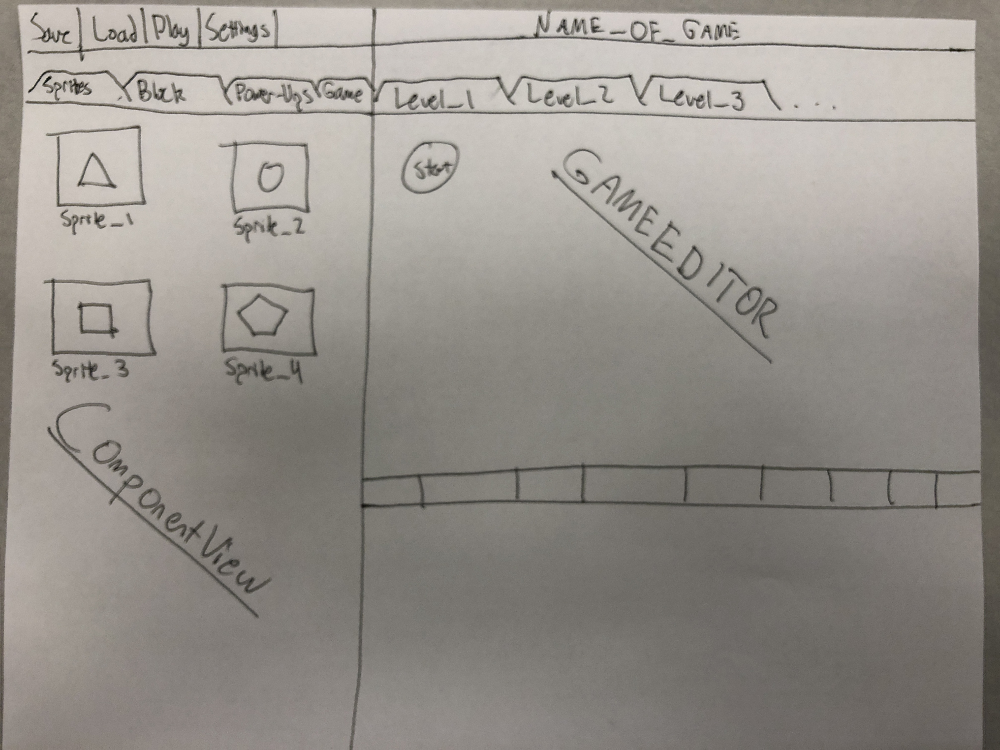
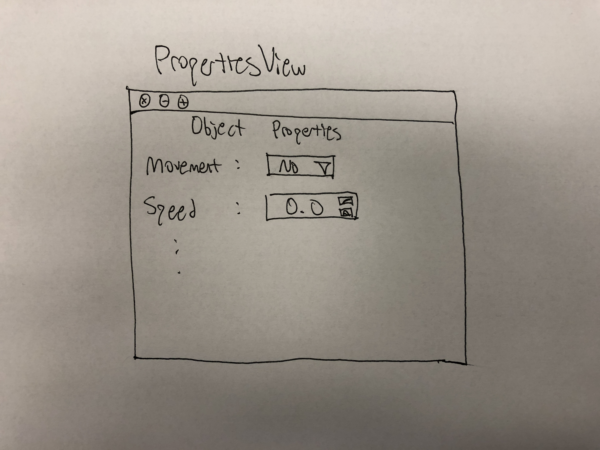

One Class, One Method Design Plan
====

# Introduction
## Problem and Design
This program aims to create a game authoring environment and player that enables the user to create, save, and play a custom platformer game. This also involves the development of a game engine to run the game, and some method of data storage to store, save, and load game states.

The primary design goals are to give the user as wide a range of options as possible, while also building a stable and functional game environment. Additionally, the user interfaces should be as clear and intuitive as possible. 

The game engine is being designed to be as flexible as possible by using an Entity-Component-System design pattern, which makes the behavior of game objects to be entirely determined by which "components" are included in each entity. This should allow for great flexibility in the design and customization of the game.

## Platformer
* Scrolling -- Platformers are defined by scrolling to focus on the player
* Two-Dimensions -- Platformers are generally defined by moving only along the X and Y axis as there is generally no Z dimension.
* Ability for a variety of objects with different behaviors to be placed in the scene
* Special interactions between the player's character and the dynamic environment. 

## High Level Design
--picture

The game will be designed in the game authoring environment. Once the game is defined by the user, it will be packaged together into a single serializable class called GameState, which is stored in XML. The game player will then open this GameState object, instantiate the engine, and set it running. The engine and player will read from and write to this GameState object. Generally, the engine will run a game loop, and its systems will alter components within the entities in GameState. The player will monitor these entities, render their visual images, and display the results.

### Authoring Enviroment
* IDEView
    * frontend.components
        * ViewBuilder
        * Toolbar
        * ComponentView
        * GameEnvironment
        * GameAuthorState
        * LocalPropertiesView
        * GlobalPropertiesView
    * frontend.parts
        * PartBuilder `interface`
        * GenericButton
        * TabPane
* SplashScreen

### Engine
* Engine
    * Follows a "Entity-Component-System" architecture pattern
    * Runs a game loop to continuously update internal entities
    * Internal entities contain lists of components that determine their behavior
    * Various systems (collision checker, physics engine, etc) iterate through entities' components, and update them if necessary
    * Systems are updated at each frame, and there are no communication between systems
    * Change data stored in components, and notify front-end through property change listener
    * Dynamically render the visible objects on the screen according to character's location
   

### Data
* classes
    * file writer
    * file reader
    * serializer

### Player
* ( P ) gameplay - The gameplay package handles the constant game display changes and the user input. It is used to run any and all game types. This generalizes the display so that the package can be used to run any kind of game the user authors. This package works a lot with the GameState, objects in the display package, and the GameEngine.
    * GameDisplay - Manages the gameplay display and constant screen updates as well as the user input
    * Controller - Watches the GameState object and relays any changes to the GameDisplay so that they are translated into visual changes.
* ( P ) display - The display package contains all of the various menus and buttons that could be needed to manage gameplay options. This package simply helps with the organization of all of the possible classes needed for the front end so things don't get cluttered. The classes in this package will primarily interact with the gameplay, Data, and GameState.
    * ( P ) display.menu
        * (I) Menu - An interface to define a standard design for all menus. All menus collaborate with the GameDisplay to some degree.
        * StartMenu - Menu to select authoring environment or game player
        * PauseMenu - Menu to select between resuming game, saving game, opening options, restarting game, or quitting game.
        * OptionsMenu - Menu to set/change key bindings for various controls in the game.
        * QuitMenu - Menu to select between quitting application or quitting game and going back to start menu
    * ( P ) display.hud
        * (I) HUD - An interface to define the general characteristics of a HUD. All HUDs will interact with the GameDisplay
        * Game1HUD - Each game will have it's own HUD.
    * ( P ) display.button
        * SaveButton - A button to save current state of the game to a save file
        * ResumeButton - A button to resume the game
        * QuitButton - A button to open the quit menu screen
        * RestartButton - A button to restart the current level
        * OptionsButton - A button to open the options menu
        * StartButton - A button to start the game from the start menu

# Overview
When the program is first instantiated, the user has the option of choosing between playing a game or editing a game - these are the **two largest** sub-components of the front-end, while the engine and game data are the two largest components of the back end. At a high level, the engine defines what game objects and interactions behind them are possible. The game authoring environment uses those defined interactions and objects from the engine to give the user a set of tools with which to make games. The user is free to define most features in the game, such as starting and ending points, living and dying conditions, object placements and interactions, etc. The main customization comes from combining components within various entities to give them customizable behavior. In this way, the `GameAuthoringEnvironment` subgroup is the primary editing environment for the game author. It interacts with the game data by both saving (with `save()`) and loading (with `load()`) in the form of an XML file through serialization.

On the other side, the game player loads and executes previously saved game files in order to play the game. In the back end, the engine runs the game by implementing systems that check for certain interactions between entities. It will also dynamically render objects based on the location of the player to reduce processing time. 

# User Interface
When the program is first launched, a splash screen will display letting the user choose between the game player and the authoring environment. Once they have chosen a side, another screen will appear asking them which project (game) that they would like to work on or play. Here is how each different component will handle the user interface:
* **Authoring Environment**: Once a project is loaded, there are several panes on the screen that allow the game creator to make modifications to the current state of the game. The entire environment plan looks as so: 
    * _Toolbar_: the toolbar, which appears at the top of the screen, allows the user to perform certain actions that appear in all "standard" toolbars - this includes things like saving the game and loading the game. In general, the toolbar will contain actions that we don't expect game programmers to use very often.
    * _Game Object Pane_: this pane, which will appear on the left side of the screen, will consist of several tabs, each one representing a different group of components that a game author can place. This includes things like blocks, sprites, and scenery. This will support drag-and-drop functionality where the user can drag game objects into the game environment.
    * _Game Environment_: This is the largest pane on the screen, and is located on the right side, but takes up the majority of the screen. This is where users can see the state of the current _level_. However, they can switch between levels by using the tabs at the top of this pane, each of which represents a distinct level. When the user drags a block from the game object pane, they drag it into this environment so that they can see it. This pane will accommodate scrolling so that the user can make longer levels. They will also be able to define starting and ending points here. 
    * _Local Properties View_: This will be a separate window that opens, not part of the default pane setup of the game authoring environment. After a user places a game object in the game environment, they can either double click or right click on it to open this window. Within this window, they can define certain properties, such as whether or not the object is static, how it interacts with other objects, and how long it lasts during the game. This, roughly, will look like 

* **Game Player**: This option is selected if a specific game file is desired to be played. The purpose of the game player is to render the images that depict the objects supported by the game engine onto the graphical user interface.
    * _Start Menu_: The start menu screen only has one button. This button is the load file button. When clicked, the button will display a menu that will allow you to select the game file that the user chooses to play.
    * _Game Player View_: This is the main view of the GUI that renders the objects within the game file including obstacles, characters, and other visual features. This class functions to depict all front-end objects, animations, and framing of the game based on the information from the game state data. 
    * _Pause Menu_: When the "escape" key is pressed, the pause menu will appear with several clickable buttons. These buttons all have different functions, and will allow the user to configure the game to their liking. This could include features such as sound, difficulty, language, etc. 
    * _Heads-Up Display_: A heads-up display (HUD) will be visible at the top of the game player window. The HUD will differ depending on the game file that is loaded. This HUD will also rely on the information from the game state data, and will give the user key information about the status of the game such as time, score, lives, etc.  

# Design Details
### Game Authoring Environment
The Game Authoring Environment interacts with the engine and the data (reading and writing). In order for the data to be able to save a game, it needs to have access to the current state of a game, which is contained within some sort of `GameAuthorState` class. Consequentially, one of our primary external API methods will be to give up control of the current state of the authoring environment. 
* **Game Authoring Environment Internal API**: 
    * The Game Authoring Enviroment must have the ability to read in a file. This is a saved .XML file that represents a serialized `GameAuthorState`.  This will be handled by a `load()` method.
    * The Game Authoring Environment must also have the ability to save to a file. This will be a .XML file that will represent a serialized `GameAuthorState`. We intend to use the xStream serialization toolkit. This will be handled through a `save()` method.
    * The Game Authoring Enviroment has to be able to create new instances of Game Objects. These game objects will be created by their individual constructors but adding them to the `GameAuthorState` will be handled by  a method `appendGameAuthorState` 
    * The Game Authoring Environment needs the ability to remove Game Ojects from the `GameAuthorState`. This will have to be handled by a method `removeGameAuthorState()`
    * The two functions above `appendGameAuthorState()` and `removeGameAuthorState()` will rely on a seperate API that will be used by components in the `gameView` and the `ComponentView` that handles objects being dragged and dropped. We will called this our `DragAndDropDynamicYoutility` or `DADDY`
    * The Game Authoring Environment needs the ability to edit currently instantiated Game Objects. Finding and altering these objects will be handled by a method `editGameAuthorState()`.
    * The Game Authoring Enviroment needs the capability to create new levels within itself. This will be handled by a method `appendLevelGameAuthorState()` and can be removed by `removeLevelGameAuthorState()`.
    * The Game Authroing Enviroment needs teh ability to create a new `GameAuthorState`. This will be handled through the method `newGameAuthorState()`.

### Game Player
Since the Game Player relies on the information provided by the data and supported by the engine, the Game Player must utilize the API's that allow it to access that information. With that in mind, the Game Player does not have many API's, because the Game Player functions solely to depict the front-end entities from the data.

* **Game Player Internal API**:
    * The Game Player requires the method `toggleMenu()` to allow the GamePlayerView class to control how and when certain menus are displayed. Since each unique menu implements this interface method signature, this allows the Game Player to easily toggle the visibility of how the Menu objects appear on the GUI.

* **Game Player External API**:
    * Other groups and parts of the projects require the `updateHUD()` API because it allows other classes to access and change the value displayed on the Heads-Up Display based on the information of the game state values. This allows the HUD

### Engine
### Internal API
The internal interactions within the engine centers around each system interacting with the entities' components. These systems include the physics system, collision detection, damage and health, and dynamic rendering, among others. These systems are the main submodules, and require no communication between each other. All communication is indirect through the changing of component values. 

Each entity needs to provide API to access its components. For example, the collision detection system will iterate through all entities that have a physical component, and the health management system will iterate through all entities with a health component.

Each components should provide API to allow systems change its data. Examples of components are location, velocity, health, sprite, visibility, character, etc. 

### External API
The game engine provides API to "start", "pause" and "stop" the game.
#### Game Authoring Environment
Each system and component will have a description method that returns a String. This method will most likely be static. This will allow the game authoring environment to provide the user with details behind the components and how they interact with the systems. Otherwise, the engine will not interact with the authoring environment.

#### Game Player
The game player and engine will communicate primarily through the GameState class instantiated by the player. The engine will have start, pause, and stop methods that control the flow of the game loop. The engine will also be constructed with the GameState object. 

# Example Games
## Donkey Kong
Donkey Kong is one of the OG platformers. The map was static and there was an extremely limited number of moving objects. The levels were not dynamically changing and instead the game relied on increasing speed to make up for gameplay dynamics that were far from challenging.
## Mario
Mario is by far the most iconic platformer. The game leveraged a grid system of uniform blocks to design simple maps. Users movement was restricted to two dimensions and in early version and the camera only moved along one axis. We'd like to build a game more similar to later versions of Mario where the user can also move beyond one axis but we intend to stick with the grid based system of blocks for most immovable objects.
## Metroid Hunter
Metroid Hunter has more advanced gameplay dynamics than thos early mario games. In Metroid Hunter, the user had various different attacks and more advanced jumping. We'd like to eventually extend the game to handle more advanced gameplay dynamics. 
# Design Considerations
We had several confliciting design considerations that were very contentious. In the discussion of these options, we gained better understanding of our design as a whole. They are as follows:
* Whether or not to put game objects in the engine-- 
    * We were conflicted between expanding the authoring environment to contain the logic and options for all objects that would be put into the game. This would allow a much easier pairing between the authoring environment and the data when it saves. On the other hand, writing frameworks for such classes in the engine would allow for easier pairing with the logic that plays the game, and we ultimately decided on this design because it allows us to integrate logic for handeling interactions with the objects.
* whether or not to use the component strucutre--
    * we ultimately decided to use this design pattern because it offers great flexibility in creating new objects in the game. By giving attributes to entities via components, we can create a wide variety of game objects. This will be difficult to implement because systems that handle a wide variety of component combinations will need to be written, but the flexibility is too exciting
* how to manage scrolling in the platformers--
    * We are still deliberating this choice. There are a variety of options including having set renderable blocks of a level that need to be loaded every time the player reaches the end of the screen, rendering levels in sections that the player can scroll through, and rendering levels dynamically everytime the player moves. We are considering rendering things in chuncks which is in the middle of difficulty and value added to the game designer.

