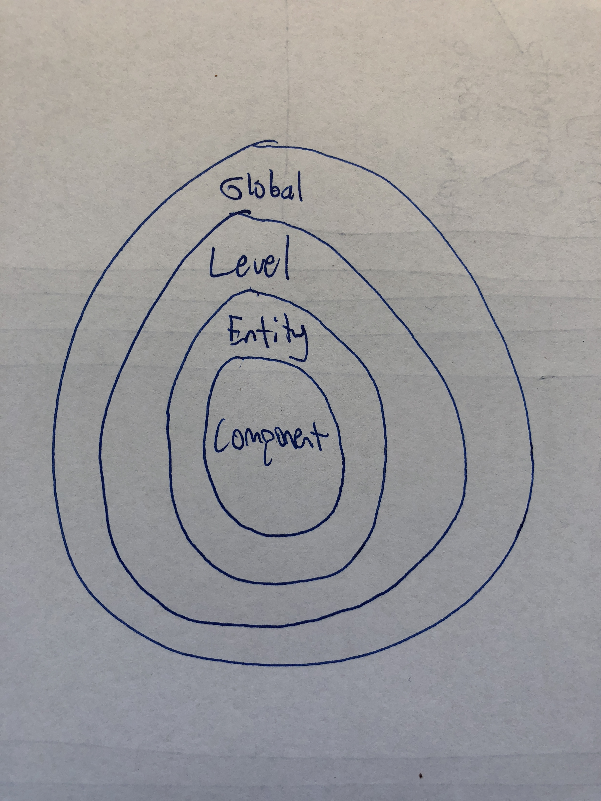

Game Authoring Environment 
======

### Architecture

* MVC-style, but instead of separating model from view, controller separates entity creator vs. editor
    * Entities are created in `EntityCreator`, and then the controller transfers the object to the `EntityEditor`
* Controller also keeps track of the whole global state
    * Global holds list of levels
    * Level holds list of entities
    * Entity holds list of components
* State (interface) closed to modification - state will always be represented the same way

* User edits the game by adding and editing [components](https://coursework.cs.duke.edu/CompSci308_2018Spring/voogasalad_oneclassonemethod/tree/master/src/engine/components)
    * Our primary goal is no code change if the engine wants to add a component
    * `ComponentForm` builds components with reflection and adds them to existing entity

### Interactions
* **Public-facing API**
    * `IGameState`, which allows the data team to save and serialize all current entities, components, levels, and global properties
* **Engine**
    * Must flexibly offer the user to add components that exist in engine
    * Properties files indicates which components a specific entity type (player, enemy, block) can hold
